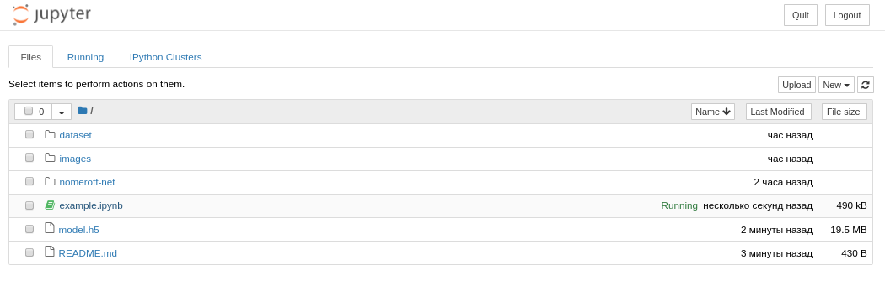

# hackayon-AUTO-RIA-2019
Хакатон от AUTO RIA 
Задание предпологает установленный python3.6 и pip3 на вашем компьютере.
 
Перед тем как начать установите jupyter notebook
 
<code>
pip3 install --upgrade pip
pip3 install jupyter
</code>

 
После установки, запустите jupyter в папке проэкта
 
<code>
jupyter notebook --allow-root
</code>

 
И откройте example.ipynb:

